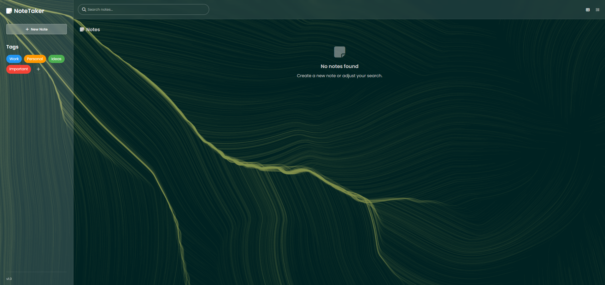

# 🗒️ Note-Making-App

A clean and aesthetic note-taking web app built using **HTML**, **CSS**, and **JavaScript**. This project allows users to create, organize, and manage notes with an intuitive UI and tag-based system.

## 🚀 Features

- Create and delete notes
- Add colorful tags (e.g., Work, Personal, Ideas, Important)
- Search notes instantly
- Clean and responsive UI
- Built with pure HTML, CSS, and vanilla JavaScript — no frameworks

## 📸 Preview

 <!-- You can upload an image and update the path -->

## 💻 Technologies Used

- HTML5
- CSS3
- JavaScript (Vanilla)

## 📂 How to Run

>> Clone the repo:
   ```bash
   git clone https://github.com/darko-mode/Note-Making-App.git
